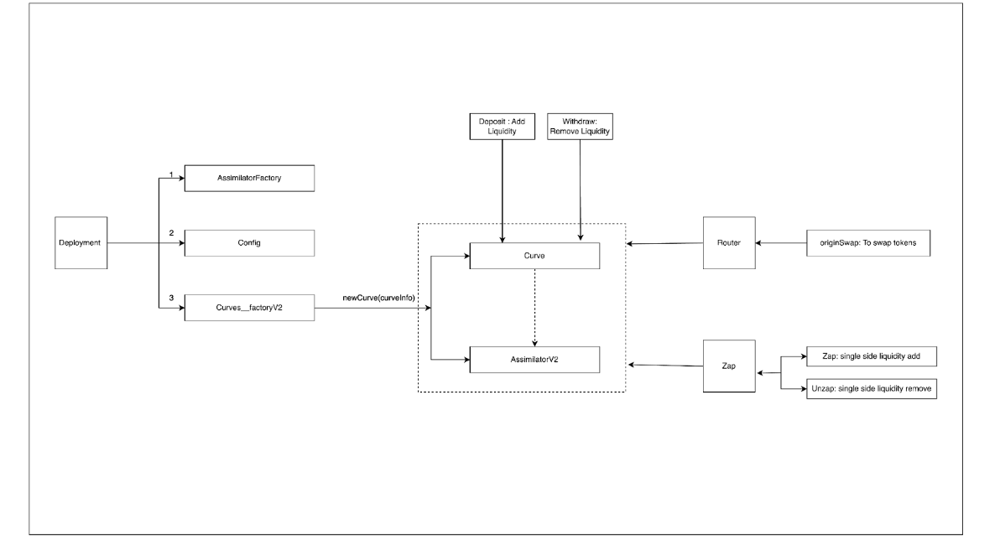

# Contracts Overview

## AssimilatorFactory

- This contract is used to create new assimilators, which are internally called by Curve_factoryV2.
- It also provides functionality to view or revoke any assimilator.

## Config

- This contract is deployed with 2 parameters: protocol fee (0.05%) and treasury address.
- The treasury address could be any EOA or multisig wallet.
- Basically, this contract is used to change or view protocol fees or treasury address.
- This contract also has functions to set pool guards or freeze the pool.

## Curves\_\_factoryV2

- This contract is used to deploy new curve pair pool contracts and their assimilators.
- Curve information is provided to the `new curve` function of this contract, which deploys new curve and assimilator contracts for the curve pair.

## Curve

- This contract is used for swaps, deposits, and withdrawals in the contract.
- It acts as the LP token.
- This contract uses different libraries to handle different operations:
  - Swap: Handles token swaps.
  - ProportionalLiquidity: Used for depositing and withdrawing liquidity.
  - Orchestrator: Used to view curve details and set curve details.

## AssimilatorV2

- This contract is used to handle pair tokens and is called by the curve contract.
- It holds the liquidity of the tokens.
- This contract also provides numeraire balance and raw balance of tokens for different calculations (oracle and mathematical operations).

## Zap

- This contract is used to add and remove single-side liquidity.
- It interacts with curve contracts to add and remove liquidity for a single side only.
- Internally, it uses the swap function.
- `Zap` handles single-side liquidity addition.
- `Unzap` handles single-side liquidity removal.

## Router

- This contract is used to perform token swaps.
- It uses different curve contracts for swapping.
- Currently, only single-hop swaps are available.
- The `originSwap` function is used to perform the swap. It takes three input currencies:
  - Origin: The token that the user wants to exchange.
  - Target: The token that the user wants to receive in exchange.
  - Quote: Generally, this represents USDC.

